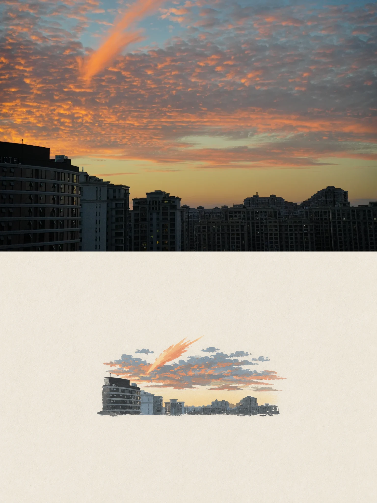
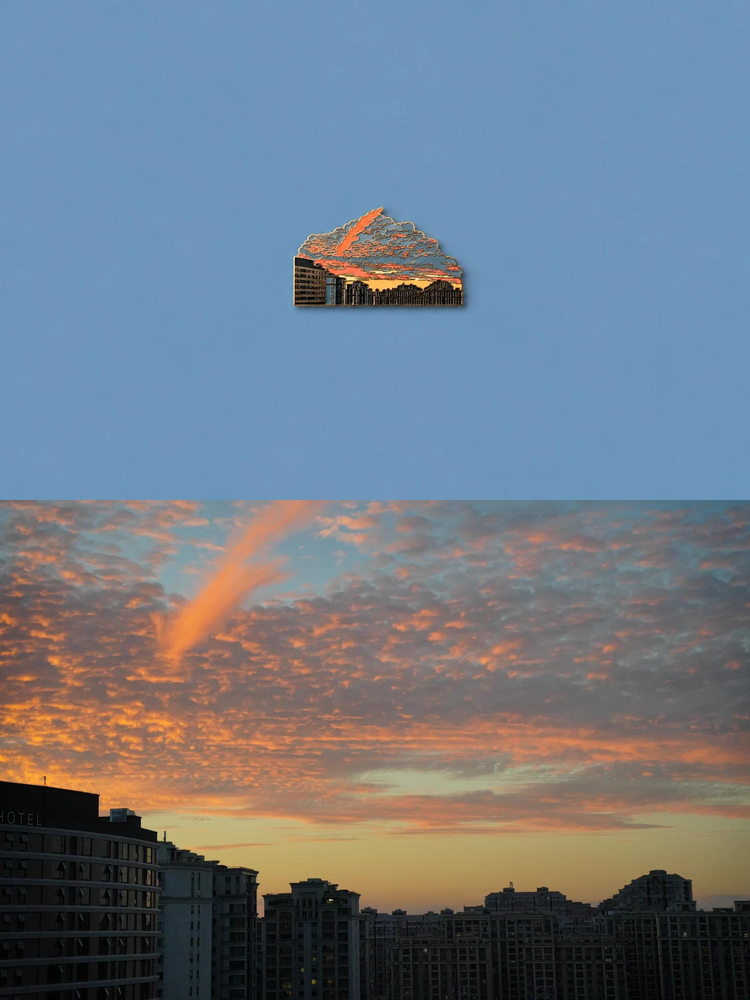
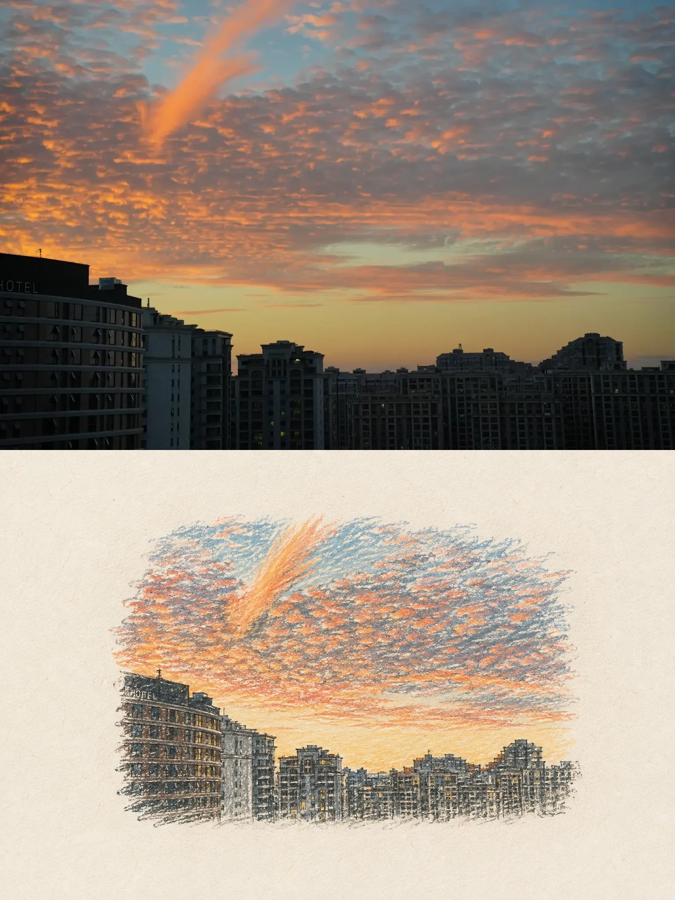
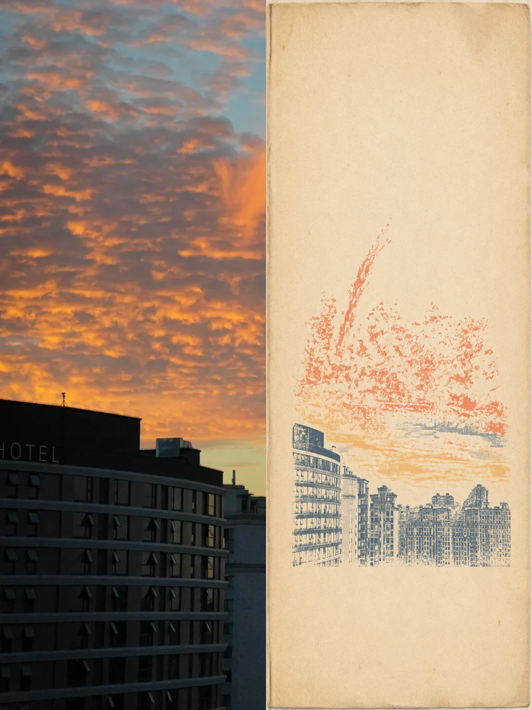
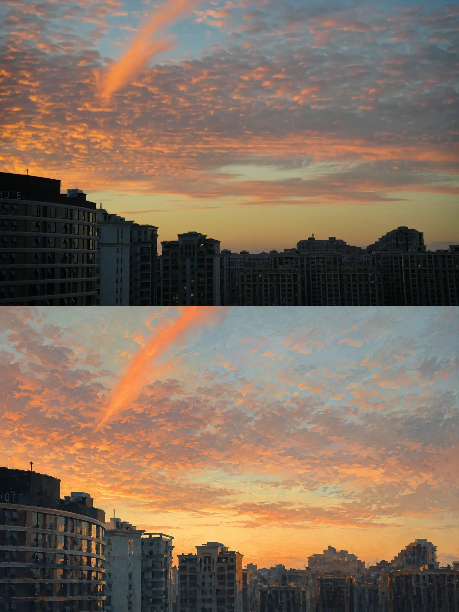
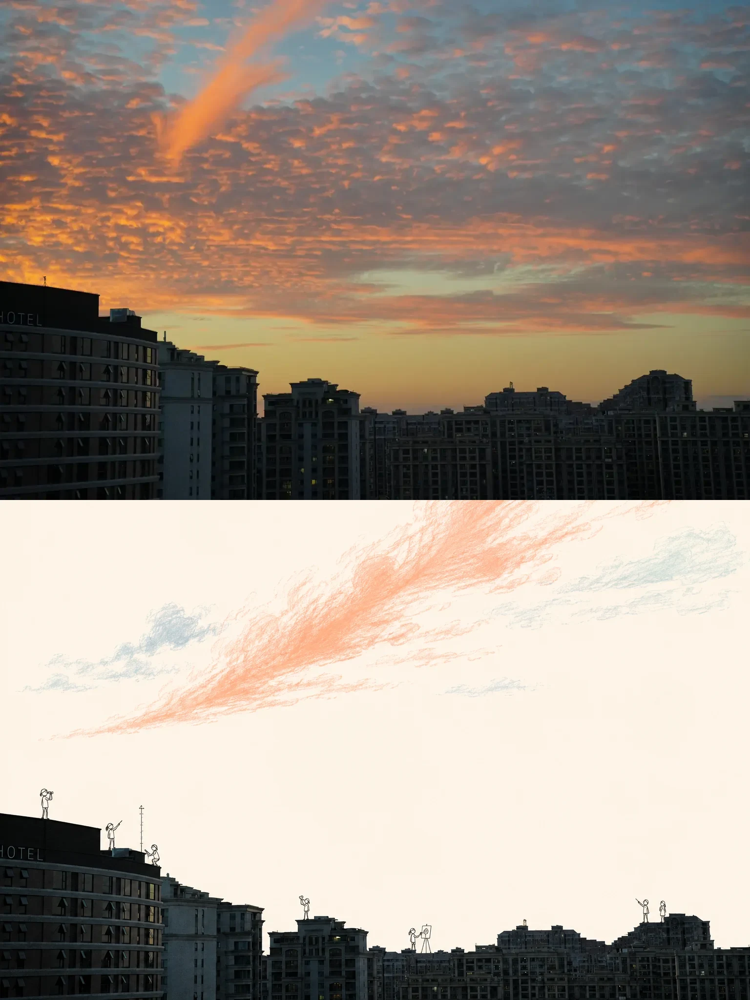
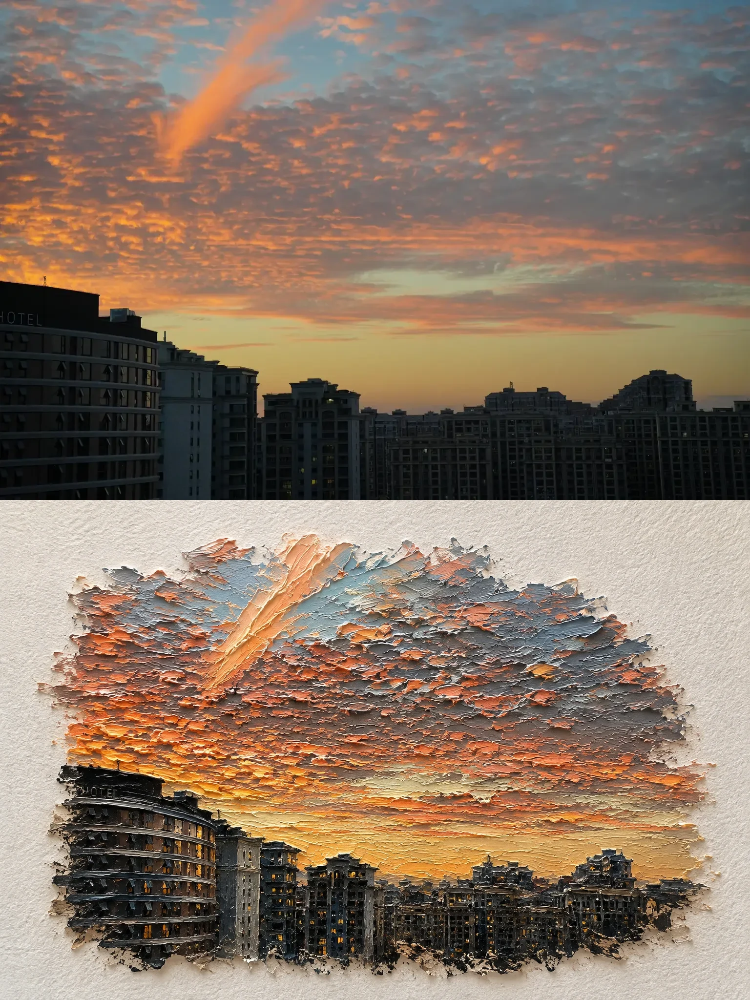
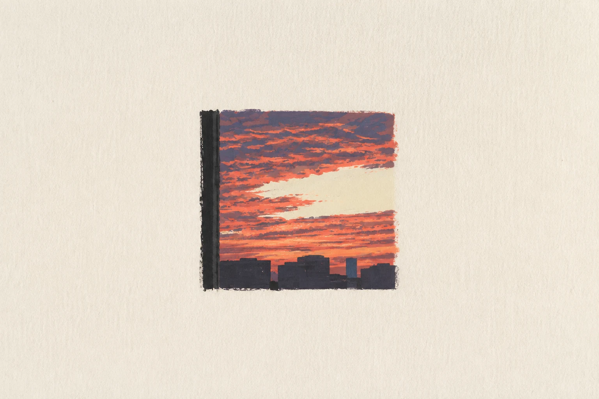
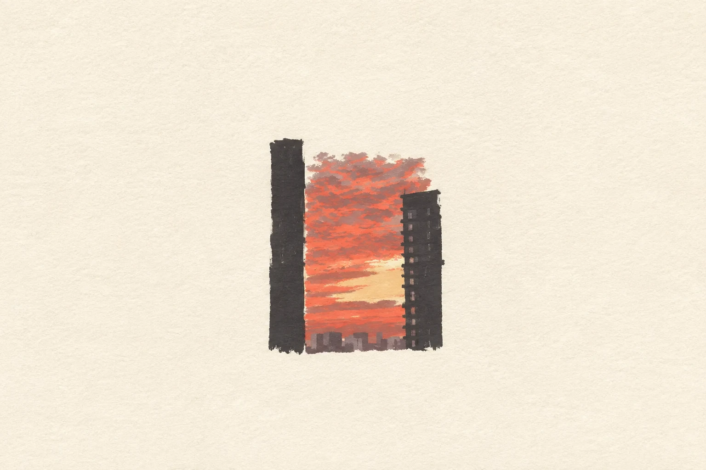

<div align="center">

# Image Skillbook

### A multi-Skill image style pack: one router, seven visual Skills.

Turn photographs into repeatable, tested visual treatments. Designed first for
Codex and its built-in GPT image workflow; portable to compatible Skill runtimes.

[](#eight-installable-skills)
[](references/recipes/index.md)
[](LICENSE)

[简体中文](README.zh-CN.md)

</div>

> **Quick start:** install the router and all seven style Skills, attach an image,
> then name a style or let Image Skillbook recommend one.

```bash
npx skills add AlbertAZ1992/image-skillbook \
  --skill '*' --global --agent codex --yes
```

```text
Use $image-skillbook with Editorial Painted Memory on this photograph.
```

## See every style work

One source photograph, seven different visual Skills. These are real outputs, not
mockups or untested prompt samples.

Every example follows the same execution path:

```text
$image-skillbook → select recipe → compile for this image
                 → generate → verify → save project asset
```

No recovered raw Prompt Inbox entry was sent directly to the image model, and the
external `photo-abstract-editorial` skill was not used.

<p align="center">
  
</p>

<table>
  <tr>
    <th width="50%">
      <a href="skills/editorial-painted-memory/README.md">
        Editorial Painted Memory
      </a>
    </th>
    <th width="50%">
      <a href="skills/enamel-travel-keepsake/README.md">
        Enamel Travel Keepsake
      </a>
    </th>
  </tr>
  <tr>
    <td>
      
    </td>
    <td>
      
    </td>
  </tr>
  <tr>
    <td>Production mode keeps the photograph intact and assembles an exact 3:4, 50:50 diptych.</td>
    <td>Adaptive mode compresses the skyline and cloud into a manufacturable object.</td>
  </tr>
  <tr>
    <th>
      <a href="skills/crayon-memory-postcard/README.md">
        Crayon Memory Postcard
      </a>
    </th>
    <th>
      <a href="skills/rubber-stamp-travel-journal/README.md">
        Rubber Stamp Travel Journal
      </a>
    </th>
  </tr>
  <tr>
    <td>
      
    </td>
    <td>
      
    </td>
  </tr>
  <tr>
    <td>Production mode pairs the intact photo with a soft, wax-grain recollection.</td>
    <td>Production mode reduces the scene to tactile carved marks and limited inks.</td>
  </tr>
  <tr>
    <th>
      <a href="skills/painted-editorial-reconstruction/README.md">
        Painted Editorial Reconstruction
      </a>
    </th>
    <th>
      <a href="skills/photo-doodle-story/README.md">
        Photo Doodle Story
      </a>
    </th>
  </tr>
  <tr>
    <td>
      
    </td>
    <td>
      
    </td>
  </tr>
  <tr>
    <td>Production mode retells the same composition with broad, visible brushwork.</td>
    <td>Production mode keeps the real scene and adds a restrained miniature story.</td>
  </tr>
  <tr>
    <th colspan="2">
      <a href="skills/impasto-miniature-world/README.md">
        Impasto Miniature World
      </a>
    </th>
  </tr>
  <tr>
    <td colspan="2" align="center">
      
    </td>
  </tr>
  <tr>
    <td colspan="2" align="center">
      Production mode rebuilds the scene as a tactile oil-paint diorama.
    </td>
  </tr>
</table>

## What exactly is Image Skillbook?

**Image Skillbook is a product and a multi-Skill repository.** It is not one giant
visual Skill.

| Layer | What it means | Installable? |
| --- | --- | --- |
| Image Skillbook | Product, repository, and distribution pack | Install source |
| `$image-skillbook` | Umbrella Skill that discovers and routes styles | Yes |
| Seven style Skills | Focused units, one visual treatment each | Yes |
| Recipe | Reviewed design contract behind a style Skill | No |

The repository therefore contains **8 installable Skills**: one router and seven
style Skills. Today each visual Recipe maps one-to-one to a style Skill. Recipes
remain public so contributors can inspect provenance, adaptation rules, and review
criteria without turning the install surface into a prompt dump.

Each Skill lives at `skills/<name>/SKILL.md`, the conventional multi-Skill layout
used by the Skills CLI. Every style Skill also has its own human-facing README with
a before-and-after example, one-Skill installation command, trigger, and visual
contract. Its preview assets travel with the installed Skill, so the page remains
self-contained outside this repository. The root README is the combined showroom,
while each `SKILL.md` remains the agent-facing entry point.

## Codex + GPT Image first

- Every Skill includes Codex-facing metadata and a ready-to-run `$skill-name`
  starter.
- Codex can inspect the supplied image, invoke built-in image generation or editing,
  review the result, and save the output in one workflow.
- The standard Agent Skills layout remains portable. Other compatible agents can
  execute the same contracts or use Prompt-only mode when no image tool is present.

### The same recipe across three more photographs

These lower-panel studies test whether Editorial Painted Memory preserves the
recognizable composition of different source photographs. They are intermediate
Production assets rather than complete posters.

<table>
  <tr>
    <th width="42%">Source</th>
    <th width="58%">Paper recollection</th>
  </tr>
  <tr>
    <td>
      
    </td>
    <td>
      
    </td>
  </tr>
  <tr>
    <td>
      
    </td>
    <td>
      
    </td>
  </tr>
  <tr>
    <td>
      
    </td>
    <td>
      
    </td>
  </tr>
</table>

All seven styles now have first-pass Draft evidence on the same source. A recipe
becomes Featured only after it works across three meaningfully different inputs and
wins a human comparison.

## Why Image Skillbook?

Strong image prompts are scattered across social posts, screenshots, and private
notes. Most work once, on one image, in one model. They rarely explain which words
create the look, what must remain unchanged, or how to tell a good result from a
generic imitation.

Image Skillbook turns a prompt into a reusable **visual recipe**:

- a small creative kernel that produces the look;
- an explicit input, output, and fidelity contract;
- adaptation rules for different subjects and compositions;
- a Direct, Adaptive, or Production execution mode; and
- review questions and provenance before promotion.

It is a curated recipe book, not a thousand-prompt dump.

## What it produces

Depending on the request and available tools, Image Skillbook returns:

- one finished image per supplied input;
- a production-ready prompt for another image model;
- exact deterministic assembly when geometry or source fidelity matters; or
- a reviewable Draft Recipe created from a new visual technique.

The skill keeps the expressive part of image generation separate from measurable
finishing work. The image model creates the artwork; deterministic tools handle
exact dimensions, splits, and unchanged source regions when needed.

## Eight installable skills

The repository contains one umbrella Skill for discovery and routing plus seven
self-contained style Skills. The styles remain usable on their own in environments
that support the Agent Skills format.

| Installable Skill | Best for | Default |
| --- | --- | --- |
| [`$image-skillbook`][router-skill] | Style discovery and routing | Router |
| [`$editorial-painted-memory`][painted-skill] | Acrylic paper memory | Direct |
| [`$enamel-travel-keepsake`][enamel-skill] | Collectible place objects | Adaptive |
| [`$crayon-memory-postcard`][crayon-skill] | Warm wax-grain memory | Production |
| [`$rubber-stamp-travel-journal`][stamp-skill] | Carved ink journal | Production |
| [`$painted-editorial-reconstruction`][reconstruction-skill] | Painted retelling | Production |
| [`$photo-doodle-story`][doodle-skill] | Real photo + line characters | Production |
| [`$impasto-miniature-world`][impasto-skill] | Sculptural oil-paint world | Production |

[painted-memory]: references/recipes/editorial-painted-memory.md
[enamel-keepsake]: references/recipes/enamel-travel-keepsake.md
[router-skill]: skills/image-skillbook/SKILL.md
[painted-skill]: skills/editorial-painted-memory/README.md
[enamel-skill]: skills/enamel-travel-keepsake/README.md
[crayon-skill]: skills/crayon-memory-postcard/README.md
[stamp-skill]: skills/rubber-stamp-travel-journal/README.md
[reconstruction-skill]: skills/painted-editorial-reconstruction/README.md
[doodle-skill]: skills/photo-doodle-story/README.md
[impasto-skill]: skills/impasto-miniature-world/README.md

The seven style Recipes are all Drafts. The gallery proves that every Skill executes;
it does not yet prove broad reliability across unrelated subjects.

## Usage

Skill names are triggers, not shell commands. Attach one or more images and mention
the `$skill-name` in natural language.

### Let the skill choose

```text
Use $image-skillbook to recommend up to three recipes for this photo.
Explain the trade-offs and do not generate yet.
```

### Apply a named recipe

```text
Use $enamel-travel-keepsake on every attached photo.
Create a separate output for each input.
```

```text
Use $photo-doodle-story on this photograph.
Keep the source photograph unchanged and create one separate result.
```

### Ask only for the compiled prompt

```text
Use $editorial-painted-memory in Prompt-only mode.
I will run the final prompt in GPT-Image myself.
```

### Turn a discovery into a recipe

```text
Use $image-skillbook to review prompt-inbox/INBOX.md.
Process the first unreviewed prompt into a Draft Recipe without publishing
uncleared third-party wording.
```

## Good for / Not for

| Good for | Not for |
| --- | --- |
| Reusing a recognizable image treatment | Generic resizing or compression |
| Applying one style to several separate images | Deterministic SVG or icon drawing |
| Preserving a proven prompt with minimal wrapping | Hiding unknown prompt provenance |
| Comparing style recipes on the same source | Combining photos without being asked |
| Exact production assembly after generation | Guaranteeing identical output across models |

## How it works

```text
Image + intent
    ↓
Discover or select one recipe
    ↓
Choose Direct, Adaptive, Production, or Prompt-only
    ↓
Compile without prompt bloat
    ↓
Generate one asset per input
    ↓
Verify subject, style, text, fidelity, and geometry
```

### Execution modes

| Mode | Optimizes for | Behavior |
| --- | --- | --- |
| Direct | Visual quality | Keeps a proven creative prompt nearly intact |
| Adaptive | Reuse | Adjusts composition and simplification to the supplied image |
| Production | Exact delivery | Generates expressive regions, then assembles measurable geometry |
| Prompt-only | Portability | Returns a ready-to-paste prompt without generating |

## Installation

Install the complete pack with the standard Skills CLI:

```bash
npx skills add AlbertAZ1992/image-skillbook \
  --skill '*' --global --agent codex --yes
```

Install only one style when routing is unnecessary:

```bash
npx skills add AlbertAZ1992/image-skillbook \
  --skill photo-doodle-story --global --agent codex --yes
```

For contributors working from a local checkout, the repository includes a one-step
installer for all eight Skills:

```bash
npm run install:local
# or: bash scripts/install-local.sh
```

Start a new agent session after installation. Image generation is optional: when no
image tool is available, the skill falls back to Prompt-only mode.

## Contributing a recipe

A public social post is not automatically an open license. Do not paste uncleared
third-party prompts into the public catalog.

1. Capture the raw prompt, source URL, author, model, and reuse terms locally.
2. Identify the smallest visual decision that makes the result distinctive.
3. Obtain permission or write an independent recipe from the general technique.
4. Test across different subjects, densities, and orientations.
5. Add the recipe, catalog entry, and review evidence together.

See [the contribution workflow](references/contributing-recipes.md) and
[recipe format](references/recipe-format.md).

## Repository structure

```text
image-skillbook/
├── skills/
│   ├── image-skillbook/SKILL.md
│   └── <style-name>/
│       ├── README.md          # human-facing example and usage
│       ├── SKILL.md           # agent-facing execution contract
│       ├── agents/openai.yaml # Codex metadata and starter
│       └── assets/            # self-contained preview images
├── catalog.json
├── assets/examples/
├── prompt-inbox/              # local raw intake; ignored by Git
├── references/
│   ├── recipes/
│   ├── recipe-format.md
│   ├── contributing-recipes.md
│   └── tool-adapters.md
├── evals/evals.json
└── scripts/
    ├── install-local.sh
    └── verify.mjs
```

## Known limitations

- Image models may interpret the same recipe differently.
- Exact source preservation and split ratios require Production mode.
- Draft examples prove that a workflow runs; they do not prove broad reliability.
- Recipes with unresolved source rights remain Draft and exclude raw third-party
  wording.

## Verify locally

```bash
npm run verify
npx --yes skills@latest add . --list
```

## License

MIT for repository-authored material. Every adapted recipe must record compatible
source rights before publication. Example provenance is documented in
[`assets/examples/README.md`](assets/examples/README.md).
