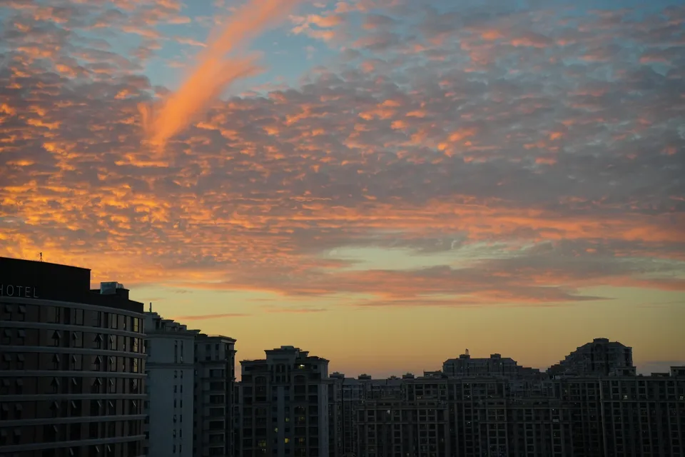

# Editorial Painted Memory — Turn a Photo into Editorial Art

[← Explore every Image Skillbook style](../../README.md)

The Editorial Painted Memory Skill turns a photograph into a quiet 3:4 editorial diptych: the
recognizable source above and a sparse acrylic-on-paper recollection below. Install it in Codex
and run it with GPT Image for a restrained photo-to-art transformation.

## Evaluation gallery

<table>
  <tr>
    <th width="42%">Source photograph</th>
    <th width="58%">Sparse painted memory</th>
  </tr>
  <tr>
    <td>
      
    </td>
    <td>
      
    </td>
  </tr>
  <tr>
    <td>
      
    </td>
    <td>
      
    </td>
  </tr>
  <tr>
    <td>
      
    </td>
    <td>
      
    </td>
  </tr>
  <tr>
    <td>
      
    </td>
    <td>
      
    </td>
  </tr>
</table>

The four-source evaluation covers skyline, a dense social scene, strong backlight, and a
vertical tree-and-street composition. Every accepted result uses Production mode for exact
geometry and selective simplification.

## Install

```bash
npx skills add AlbertAZ1992/image-skillbook \
  --skill editorial-painted-memory --global --agent codex --yes
```

## Use in Codex

```text
Use $editorial-painted-memory on this photograph.
Keep the source recognizable and create one separate 3:4 result.
```

## Visual contract

- Preserve the photographic upper half.
- Reduce the lower scene to a few decisive silhouettes and acrylic shapes.
- Keep warm paper, restrained color, imperfect lines, and generous negative space.
- Avoid crayon, watercolor, heavy oil paint, vectors, 3D, and generic cartoons.

[Read the agent instructions](SKILL.md) ·
[Inspect the Recipe](../../references/recipes/editorial-painted-memory.md)

Status: **Candidate** — reviewed across four varied photographs; object, pet, and close-portrait
inputs remain untested.
