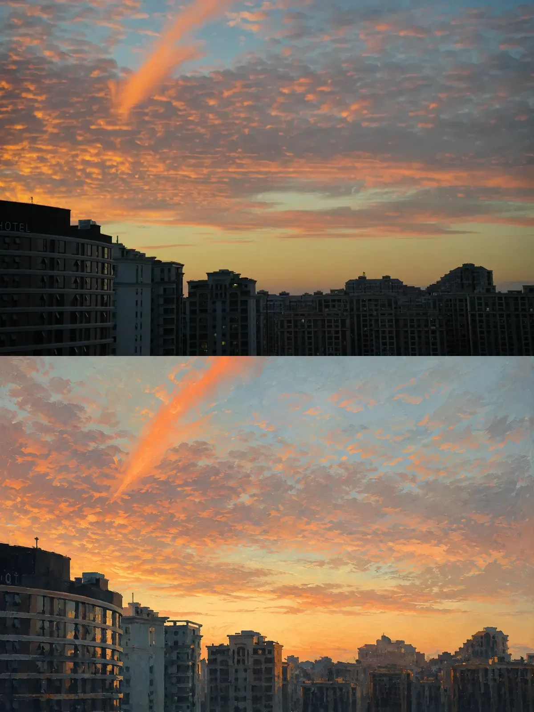
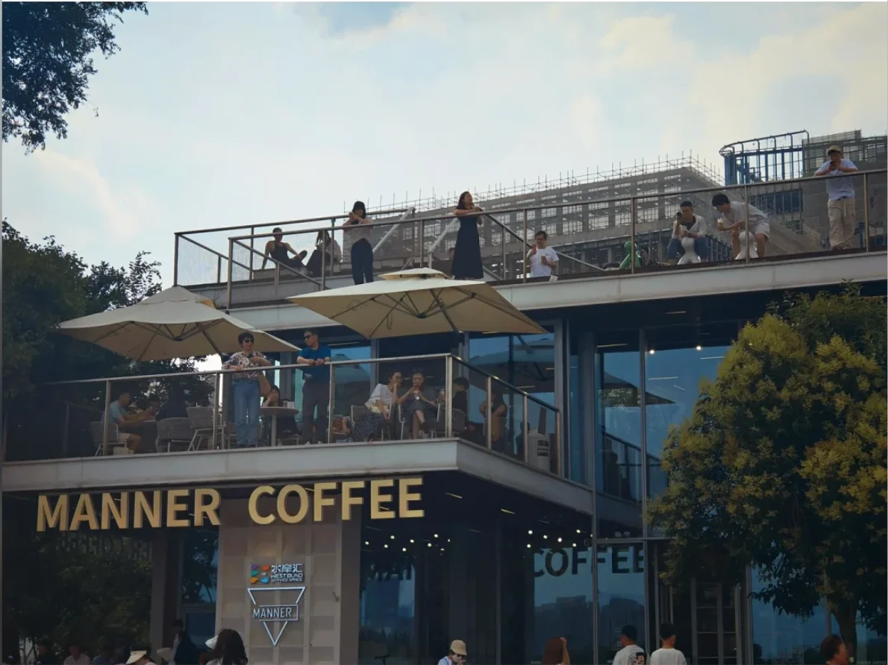
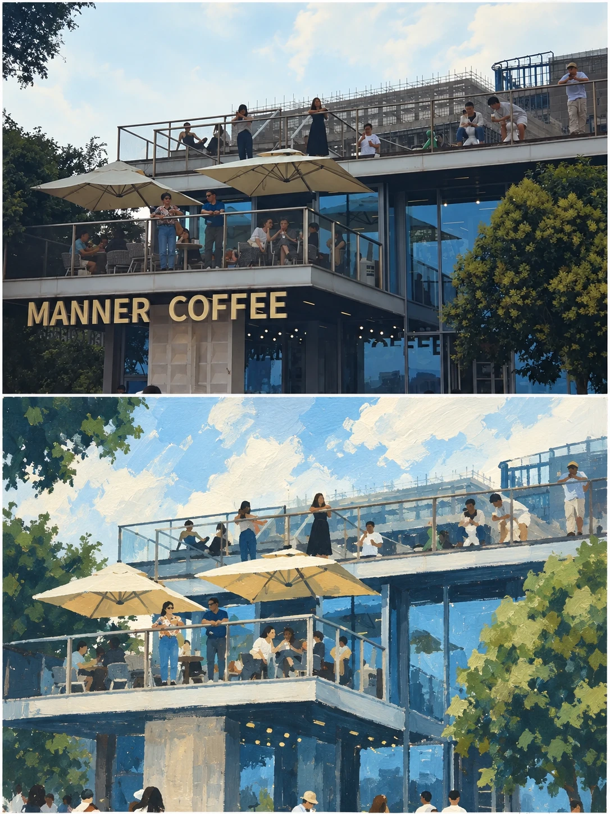
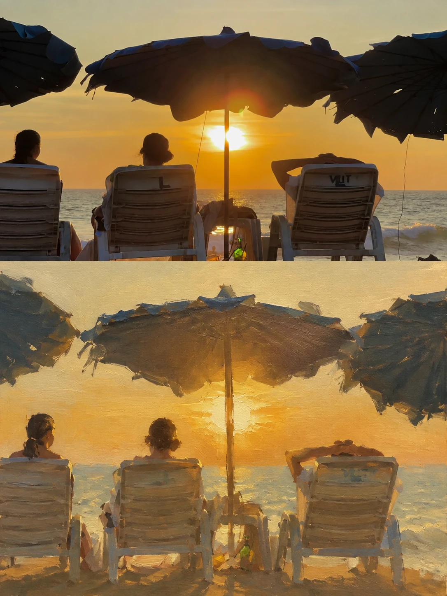
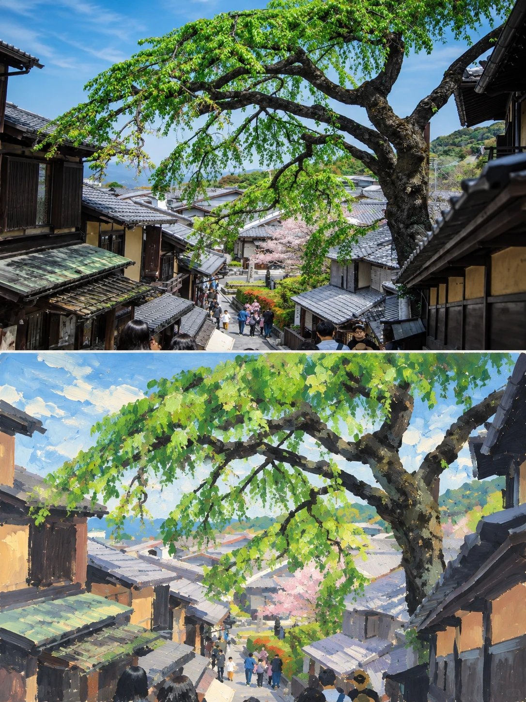

# Painted Editorial Reconstruction

[← Explore every Image Skillbook style](../../README.md)

Retell a photograph through broad gouache, acrylic, pastel, or palette-knife
gestures while keeping its central relationship and directional rhythm.

## Evaluation gallery

<table>
  <tr>
    <th width="42%">Source photograph</th>
    <th width="58%">Painted reconstruction</th>
  </tr>
  <tr>
    <td>
      
    </td>
    <td>
      
    </td>
  </tr>
  <tr>
    <td>
      
    </td>
    <td>
      
    </td>
  </tr>
  <tr>
    <td>
      
    </td>
    <td>
      
    </td>
  </tr>
  <tr>
    <td>
      
    </td>
    <td>
      
    </td>
  </tr>
</table>

The four-source evaluation covers skyline, dense social architecture, strong backlight, and a
vertical tree gesture. Each reconstruction retains the source relationship while grouping
secondary detail into broad matte shapes.

## Install

```bash
npx skills add AlbertAZ1992/image-skillbook \
  --skill painted-editorial-reconstruction --global --agent codex --yes
```

## Use in Codex

```text
Use $painted-editorial-reconstruction on this photograph.
Preserve the source and rebuild its strongest gesture with broad matte paint.
```

## Visual contract

- Preserve the photographic upper half.
- Rebuild the lower half around one source-specific gesture or relationship.
- Group detail into broad shapes with visible matte pigment and layered depth.
- Avoid literal tracing, vectors, plastic 3D, muddy filters, and decorative noise.

[Read the agent instructions](SKILL.md) ·
[Inspect the Recipe](../../references/recipes/painted-editorial-reconstruction.md)

Status: **Candidate** — reviewed across four varied photographs; objects, pets, and close
portraits remain untested.
