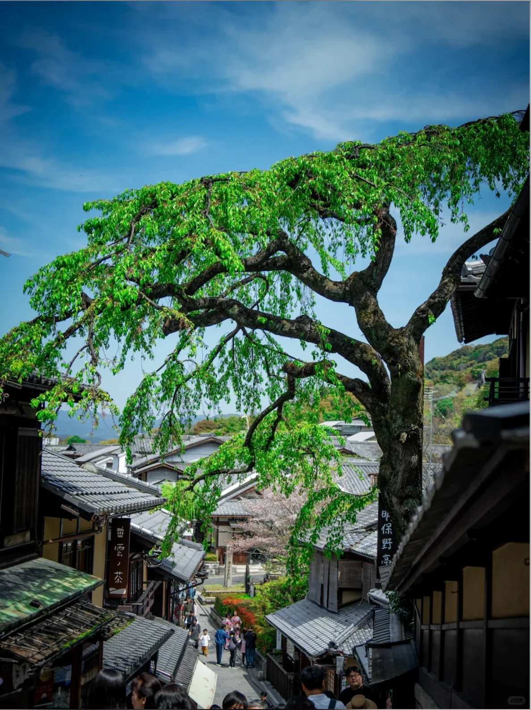

# Photo Doodle Story

[← Explore every Image Skillbook style](../../README.md)

Designed first for Codex and GPT Image, this installable Skill keeps the real photographic subject
and adds a restrained miniature story told by a few thin, imperfect black-line characters.

## Evaluation gallery

<table>
  <tr>
    <th width="42%">Source photograph</th>
    <th width="58%">Photo doodle story</th>
  </tr>
  <tr>
    <td>
      
    </td>
    <td>
      
    </td>
  </tr>
  <tr>
    <td>
      
    </td>
    <td>
      
    </td>
  </tr>
  <tr>
    <td>
      
    </td>
    <td>
      
    </td>
  </tr>
  <tr>
    <td>
      
    </td>
    <td>
      
    </td>
  </tr>
</table>

The four-source evaluation covers skyline, dense social architecture, silhouettes, and a
dominant natural subject. Every result keeps its essential photographic cue real and introduces
only one restrained line-drawn narrative.

## Install

```bash
npx skills add AlbertAZ1992/image-skillbook \
  --skill photo-doodle-story --global --agent codex --yes
```

## Use in Codex

```text
Use $photo-doodle-story on this photograph.
Keep the real scene intact and add one quiet story with tiny line figures.
```

## Visual contract

- Keep the essential subject photographic and recognizable.
- Build one source-specific action, reaction, or emotional possibility.
- Use only a few thin black-line figures and restrained source-derived accents.
- Avoid identity changes, cartoon replacement, stickers, clutter, and dense text.

[Read the agent instructions](SKILL.md) ·
[Inspect the Recipe](../../references/recipes/photo-doodle-story.md)

Status: **Candidate** — reviewed across four varied photographs; pets and close portraits remain
untested.
