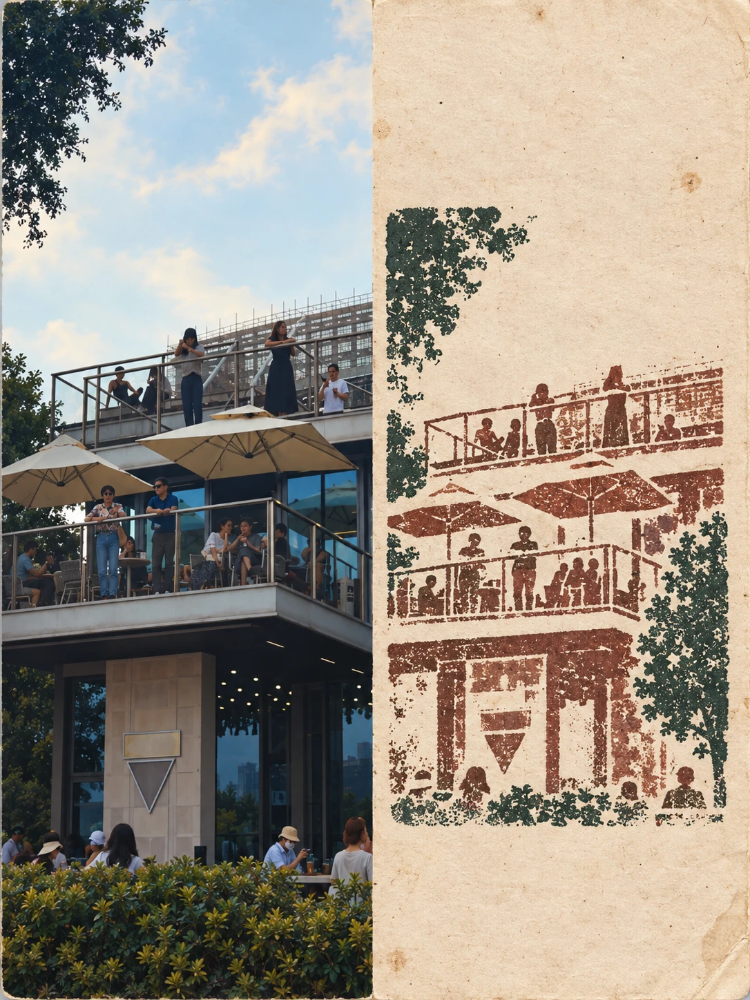
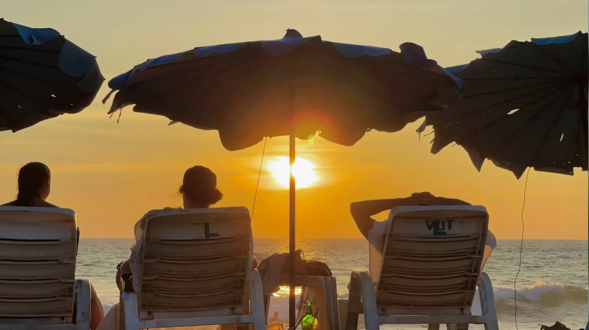
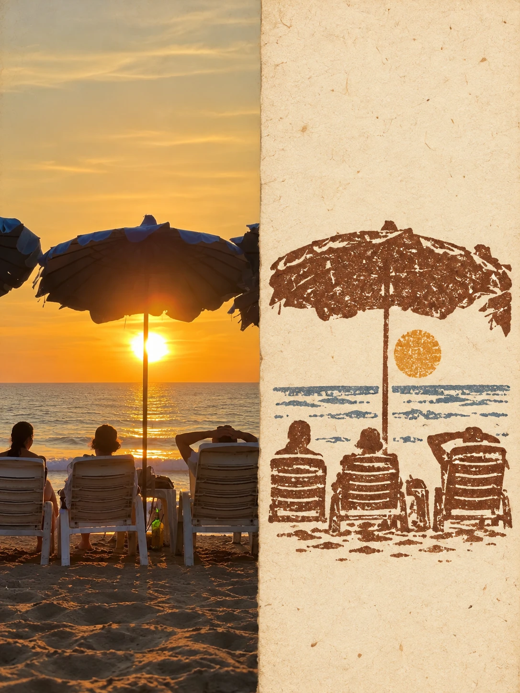
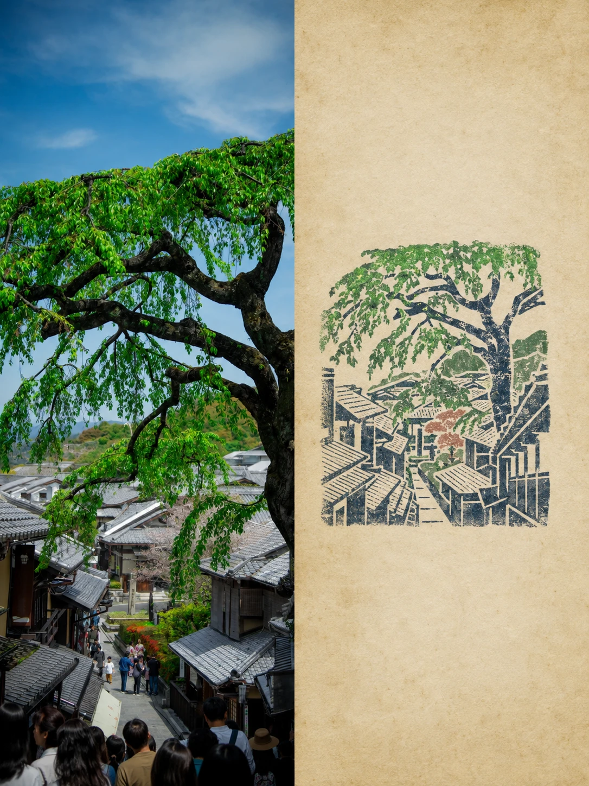

# Rubber Stamp Travel Journal

[← Explore every Image Skillbook style](../../README.md)

Designed first for Codex and GPT Image, this installable Skill pairs a place photograph with a
small multi-color rubber-stamp impression that feels hand-carved and printed into an aged field
journal.

## Evaluation gallery

<table>
  <tr>
    <th width="42%">Source photograph</th>
    <th width="58%">Carved stamp journal</th>
  </tr>
  <tr>
    <td>
      
    </td>
    <td>
      
    </td>
  </tr>
  <tr>
    <td>
      
    </td>
    <td>
      
    </td>
  </tr>
  <tr>
    <td>
      
    </td>
    <td>
      
    </td>
  </tr>
  <tr>
    <td>
      
    </td>
    <td>
      
    </td>
  </tr>
</table>

The four-source evaluation covers city, social architecture, coast, and historic street. Each
result retains place-specific contours and turns uncertain signage into unmarked geometry.

## Install

```bash
npx skills add AlbertAZ1992/image-skillbook \
  --skill rubber-stamp-travel-journal --global --agent codex --yes
```

## Use in Codex

```text
Use $rubber-stamp-travel-journal on this place photograph.
Keep the photo on the left and print a small carved-ink interpretation on paper at right.
```

## Visual contract

- Keep equal left/right regions in both portrait and landscape layouts.
- Preserve the photographic region on the left.
- Reduce the place to a few location-specific contours.
- Use two to four ink layers, dry gaps, broken edges, and registration drift.
- Avoid circular seals, postage motifs, smooth vectors, and invented geography.

[Read the agent instructions](SKILL.md) ·
[Inspect the Recipe](../../references/recipes/rubber-stamp-travel-journal.md)

Status: **Candidate** — reviewed across four varied places; interiors and close landmarks remain
untested.
